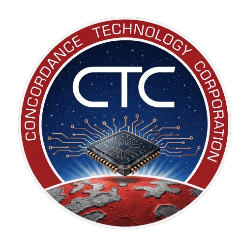

<div align="center">
  
  
  # 🔄 Sistema de Administración de Cooperativa de Reciclaje
  
  **Solución integral para la gestión eficiente de inventario de materiales reciclables**
  
  [](https://www.python.org/)
  
</div>

---

## 📋 Descripción

Sistema de administración desarrollado para cooperativas de reciclaje que permite gestionar de forma eficiente:
- 📦 Inventario de materiales reciclables (PET, Cartón, Aluminio)
- 🚚 Optimización de cargas de camiones usando algoritmos de programación dinámica
- 💰 Cálculo automático de ganancias y valor de mercado

---

## ✨ Características

### 🎯 Funcionalidades Principales

- **Gestión de Inventario**
  - Agregar materiales al inventario
  - Visualizar inventario con valor de mercado
  - Seguimiento de peso y precios unitarios

- **Carga Optimizada de Camiones**
  - Algoritmo de Mochila Fraccionaria (Knapsack Problem)
  - Ordenamiento con Insertion Sort
  - Maximización de ganancias por viaje
  - Capacidad de camión: 1000 KG

- **Interfaz Intuitiva**
  - Menú interactivo fácil de usar
  - Tablas formatadas y legibles
  - Confirmación de operaciones críticas

---

## 🛠️ Tecnologías Utilizadas

- **Lenguaje**: Python 3.14+
- **Algoritmos**:
  - Insertion Sort (ordenamiento)
  - Problema de la Mochila Fraccionaria
  - Greedy Algorithm (selección de materiales)

---

## 📦 Requisitos Previos

- Python 3.14 o superior
- Sistema operativo: Windows, macOS o Linux
- Espacio en disco: ~5 MB

---

## 🚀 Instalación

### 1. Clonar el repositorio
```bash
git clone https://github.com/usuario/proyecto-cooperativa-reciclaje.git
cd proyecto-cooperativa-reciclaje
```

### 2. Instalar con uv (gestor de paquetes rápido)

Si aún no tienes `uv` instalado:
```bash
pip install uv
```

Luego sincroniza las dependencias:
```bash
uv sync
```

---

## 💻 Uso

### Ejecutar el programa

```bash
python programa_cooperativa.py
```

### Menú Principal

```
=====================================
ADMINISTRACION COOPERATIVA DE RECICLAJE
=====================================
1. Agregar material al inventario.
2. Ver inventario en la cooperativa.
3. Cargar camion para venta.
4. Salir del programa.
```

### Ejemplos de Uso

#### Opción 1: Agregar Material
```
[?] Que material desea agregar: 1
Escriba el valor del peso en KG a ingresar: 100
```

#### Opción 2: Ver Inventario
```
INVENTARIO ACTUAL DE LA COOPERATIVA
Material             Peso (KG)       Valor/KG ($)         Valor Total ($)     
PET                  150             $2,300.00            $345,000.00
```

#### Opción 3: Cargar Camión
El sistema automáticamente:
- Ordena materiales por valor/KG (mayor primero)
- Calcula la carga óptima
- Muestra ganancia estimada
- Solicita confirmación
- Actualiza el inventario

---

## 📊 Estructura del Proyecto

```
proyecto-cooperativa-reciclaje/
├── programa_cooperativa.py   # Programa principal
├── README.md                 # Este archivo
├── pyproject.toml            # Configuración del proyecto
├── images/
│   └── logo_ctc.png          # Logo de la empresa
└── .gitignore                # Archivos ignorados por Git
```

---

## 🧮 Algoritmos Implementados

### Insertion Sort
Utilizado para ordenar materiales por valor/kg de forma descendente:
- **Complejidad Temporal**: O(n²)
- **Complejidad Espacial**: O(1)
- Eficiente para listas pequeñas

### Problema de la Mochila Fraccionaria
Maximiza la ganancia respetando la capacidad del camión:
- **Tipo**: Algoritmo Greedy
- **Estrategia**: Seleccionar materiales por mejor relación valor/peso
- **Capacidad**: 1000 KG por viaje

---

## 📈 Ejemplo de Salida

```
==========================================================================================
INVENTARIO ACTUAL DE LA COOPERATIVA
==========================================================================================
Material             Peso (KG)       Valor/KG ($)         Valor Total ($)     
------------------------------------------------------------------------------------------
PET                  50              $2,300.00            $115,000.00
Carton               30              $550.00              $16,500.00
Aluminio             5               $300.00              $1,500.00
==========================================================================================
TOTAL                85                                   $133,000.00
==========================================================================================
```

---

## 👨‍💻 Autores

**Proyecto Final - Algoritmos y Estructura de Datos**
- Juan David Cruz Salamanca
- Luis Alejandro Ardila
- Universidad: Escuela Colombiana de Ingenieria Julio Garavito
- Fecha: Mayo 2026

<div align="center">
  
  **Desarrollado por CTC**
  
  ⭐ Si te resultó útil, por favor considera dejar una estrella
  
</div>
